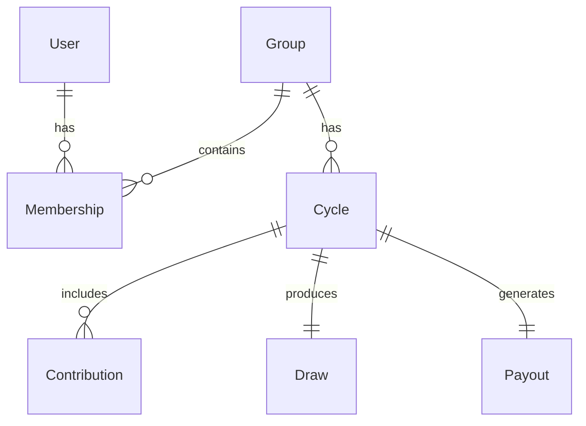

# Family ROSCA Platform – Complete Technical Specification
Version: 1.0.0
Scope: MVP (Family / Friends / Neighborhood)

---

# 1. Executive Overview

This document contains:
- Full Technical Design
- Prisma Schema
- SQL Migration Script
- NestJS Module Architecture
- ER Diagram (Mermaid)
- Core OpenAPI Definition
- Codex CLI Prompt

This is a non-custodial ROSCA platform.
The system does NOT hold funds and does NOT act as financial guarantor.

---

# 2. Prisma Schema

```prisma
generator client {
  provider = "prisma-client-js"
}

datasource db {
  provider = "postgresql"
  url      = env("DATABASE_URL")
}

model User {
  id        String   @id @default(uuid())
  phone     String   @unique
  fullName  String
  createdAt DateTime @default(now())
  updatedAt DateTime @updatedAt
  memberships Membership[]
}

model Group {
  id             String   @id @default(uuid())
  name           String
  ownerId        String
  amountPerCycle BigInt
  totalMembers   Int
  status         String   @default("ACTIVE")
  createdAt      DateTime @default(now())

  owner   User        @relation(fields: [ownerId], references: [id])
  members Membership[]
  cycles  Cycle[]
}

model Membership {
  id      String @id @default(uuid())
  groupId String
  userId  String
  role    String @default("MEMBER")

  group Group @relation(fields: [groupId], references: [id])
  user  User  @relation(fields: [userId], references: [id])

  @@unique([groupId, userId])
}

model Cycle {
  id          String   @id @default(uuid())
  groupId     String
  cycleNumber Int
  dueDate     DateTime
  status      String   @default("OPEN")

  group         Group         @relation(fields: [groupId], references: [id])
  contributions Contribution[]
  draw          Draw?
}

model Contribution {
  id        String   @id @default(uuid())
  cycleId   String
  userId    String
  amount    BigInt
  status    String   @default("PENDING")
  createdAt DateTime @default(now())

  cycle Cycle @relation(fields: [cycleId], references: [id])
  user  User  @relation(fields: [userId], references: [id])
}

model Draw {
  id        String   @id @default(uuid())
  cycleId   String   @unique
  winnerId  String
  createdAt DateTime @default(now())

  cycle Cycle @relation(fields: [cycleId], references: [id])
}

model Payout {
  id         String   @id @default(uuid())
  cycleId    String   @unique
  receiverId String
  amount     BigInt
  createdAt  DateTime @default(now())
}

model AuditLog {
  id        String   @id @default(uuid())
  entity    String
  entityId  String
  action    String
  createdAt DateTime @default(now())
}
```

---

# 3. SQL Migration

```sql
CREATE TABLE "User" (
  id UUID PRIMARY KEY,
  phone VARCHAR(20) UNIQUE NOT NULL,
  fullName TEXT NOT NULL,
  createdAt TIMESTAMP DEFAULT now(),
  updatedAt TIMESTAMP DEFAULT now()
);

CREATE TABLE "Group" (
  id UUID PRIMARY KEY,
  name TEXT NOT NULL,
  ownerId UUID REFERENCES "User"(id),
  amountPerCycle BIGINT NOT NULL,
  totalMembers INT NOT NULL,
  status TEXT DEFAULT 'ACTIVE',
  createdAt TIMESTAMP DEFAULT now()
);

CREATE TABLE "Membership" (
  id UUID PRIMARY KEY,
  groupId UUID REFERENCES "Group"(id),
  userId UUID REFERENCES "User"(id),
  role TEXT DEFAULT 'MEMBER',
  UNIQUE(groupId, userId)
);

CREATE TABLE "Cycle" (
  id UUID PRIMARY KEY,
  groupId UUID REFERENCES "Group"(id),
  cycleNumber INT,
  dueDate TIMESTAMP,
  status TEXT DEFAULT 'OPEN'
);

CREATE TABLE "Contribution" (
  id UUID PRIMARY KEY,
  cycleId UUID REFERENCES "Cycle"(id),
  userId UUID REFERENCES "User"(id),
  amount BIGINT,
  status TEXT DEFAULT 'PENDING',
  createdAt TIMESTAMP DEFAULT now()
);

CREATE TABLE "Draw" (
  id UUID PRIMARY KEY,
  cycleId UUID UNIQUE REFERENCES "Cycle"(id),
  winnerId UUID REFERENCES "User"(id),
  createdAt TIMESTAMP DEFAULT now()
);

CREATE TABLE "Payout" (
  id UUID PRIMARY KEY,
  cycleId UUID UNIQUE REFERENCES "Cycle"(id),
  receiverId UUID REFERENCES "User"(id),
  amount BIGINT,
  createdAt TIMESTAMP DEFAULT now()
);

CREATE TABLE "AuditLog" (
  id UUID PRIMARY KEY,
  entity TEXT,
  entityId TEXT,
  action TEXT,
  createdAt TIMESTAMP DEFAULT now()
);
```

---

# 4. NestJS Module Structure

```
src/
 ├── auth/
 ├── users/
 ├── groups/
 ├── memberships/
 ├── cycles/
 ├── contributions/
 ├── draws/
 ├── payouts/
 ├── audit/
```

---

# 5. ER Diagram (Mermaid)



---

# 6. Core OpenAPI Endpoints

POST /auth/otp/request  
POST /auth/otp/verify  

POST /groups  
GET /groups/{id}  

POST /groups/{id}/contributions  
PATCH /contributions/{id}/confirm  

POST /groups/{id}/draw  

GET /groups/{id}/summary  

---

# 7. Codex CLI Prompt

```
1. Analyze repository.
2. Implement Prisma schema.
3. Generate migrations.
4. Build NestJS modules.
5. Implement fair draw logic (single winner per member).
6. Add audit logging.
7. Generate Swagger documentation.
8. Prepare Docker-ready production API.
```

---

# 8. Guiding Principle

The system does not replace trust.
It structures and documents trust.
